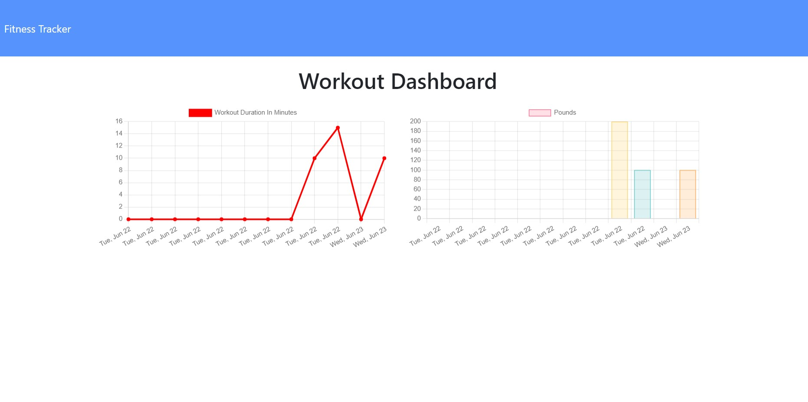

# 18-Workout-Tracker

# Description

# Table of Contents
1. [Title](Title)
2. [Description](#description)
3. [Installation](#installation)
4. [Contributing](#contribution)
5. [Questions](#questions)
6. [License](#license)
7. [Heroku](#Heroku)
8. [Screenshot](#screenshot)
# Installation 
I used 'npm i' to insall all required pacakages.
# Contribution
Myself
# Questions
## GitHub 
 Lyndseyfin
## Email 
 lyndseyfinamore@gmail.com
## License

## Heroku
<a href="https://safe-ridge-92206.herokuapp.com/exercise?id=60d3d6c2e3040800154206b7">Workout Tracker</a>

## MongoDB Atlas

## Screenshot

